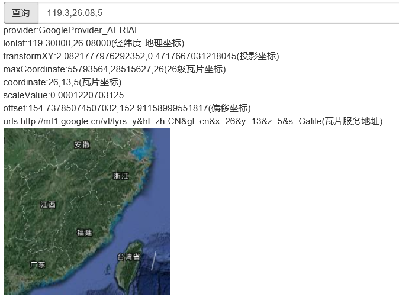

#   map
A simple map service

### 投影方式:
- MercatorProjection Web墨卡托投影
- LinearProjection 线性投影（经纬度等间隔投影）
- GaussKrugerProjection 高斯-克里格投影（等角横轴切圆柱投影）

### 在线地图:
- 谷歌地图：Web墨卡托投影
- 百度地图：Web墨卡托投影
- 天地图：  Web墨卡托投影、直线投影（未接入测试）
- 高德地图：Web墨卡托投影
- 苏州地图：高斯-克里格投影（内网）

